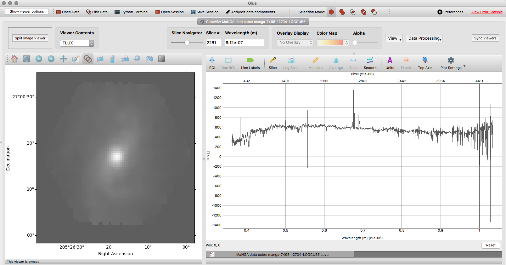
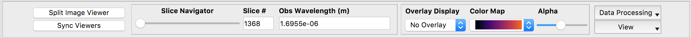

Overview of Basic CubeViz Functionality
=======================================

CubeViz has two main "modes:" Split Image Viewer and Single Image Viewer.
CubeViz starts in the Split Image Viewer which shows the flux, error,
and data quality extensions of the input data cube.  If the error
and/or data quality extensions are not present in the data cube loaded,
those views are blank.  The Single Image Viewer shows only the flux
extension.  A button in the upper left us used to switch between the
two modes.  It is labeled "Single Image Viewer" when the split image
viewer is shown, and conversely, "Split Image Viewer" when the single
image viewer is shown.  Screen shots of the two modes are shown below.

In addition to the image viewers which display the data cube in
its spatial axes (RA, DEC), a spectrum viewer shows the spectral axis
(wavelength).

.. image::  images/CubeViz_splitviewer.png 
   :align:   center

Caption: Screen shots of the split image viewer (top) and single
image viewer (bottom) are shown.

Upon loading a data cube, an image of the central wavelength channel
is displayed in the image viewer, and a spectrum of the entire cube
(collapsed wavelength space using an average) is shown in black in the
spectrum viewer.

Using the Image Viewers
-----------------------

To manipulate an image displayed in an image viewer, the user should
click on that image and then the "Show viewer options" button in the
upper left of CubeViz.  Clicking on this button reveals a hidden
control panel.  This panel allows the user to edit the limits displayed,
image display scale (linear, log, etc.), color map, and contrast/bias.
The user can hide the control panel again by clicking on the
"Show viewer options" button in the upper left.

The user can also interact with the image panels using the menu bar
across the top:

This is below the very top glue menu bar.  The left-most part of the menu
bar shows three pull-down menus which list the extension of the loaded
data cube that is currently displayed in each of the image panels
(or image panel if the Single Image Viewer is being used).  The user
can choose to change the extensions displayed using these pull-down menus.
The viewers can be synced spatially with each other by clicking
on each check box.  With synced viewers, the user can zoom in and out and
pan on one image (e.g., flux) and the other images (e.g., error
and data quality) will automatically zoom in and out and pan in the same manner.

The next panel to the right in the menu bar includes the "Slice Navigator."
This allows the user to dislpay different slices/wavelength channels in
the data cube.  It can be used with the mouse by moving the circular
button, or with the arrow keys.  The slice displayed and its wavelegth
are also displayed in this panel.

The third panel shows the controls to display an overlay.  This is not
yet implemented and therefore greyed out.

The last part of this menu bar shows three drop-down menus.  The first,
"View," allows the user to change the components of the cube displayed
(RA, DEC, wavelength) in all the image viewers.  It also gives options
to hide the coordinate axes and tool bars on the image viewers.
(Finally, there is another button to sync the viewers?)

Selecting a Region in the Image Viewers 
----------------------------------------	     

Regions can be selected in the image viewers. If they are spatial
regions (RA, DEC), the cube will be collapsed in wavelength space
over the regions, and the resulting spectrum displayed in the spectrum viewer.
Below we describe how to do this.

