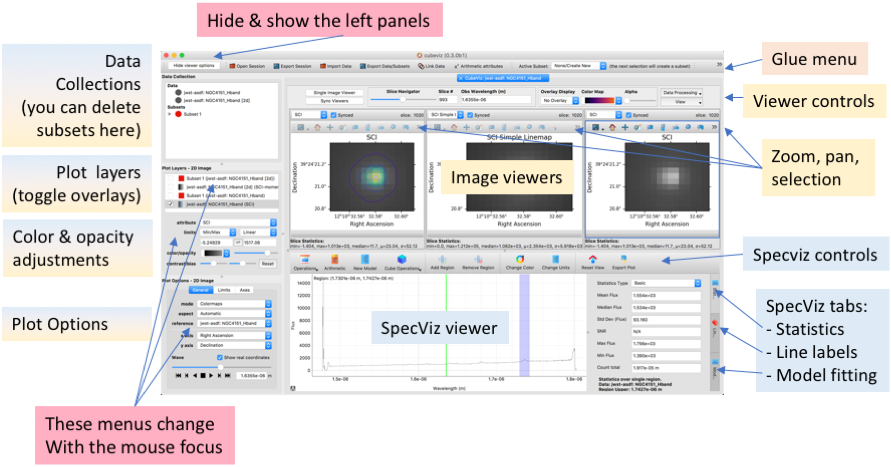

Overview of Basic CubeViz Functionality
=======================================

CubeViz has two main "modes:" Split Image Viewer and Single Image Viewer.
CubeViz starts in the Split Image Viewer which shows the flux, error,
and data quality extensions of the input data cube.  If the error
and/or data quality extensions are not present in the data cube loaded,
those views are blank. The Single Image Viewer shows only the flux
extension.  In addition to the image viewers which display the data cube in
its spatial axes (RA, DEC), a spectrum viewer shows the spectral axis
(wavelength).

The figure below shows the split-image view, with various
panels labeled. 

   Labeled screen shot of the split image viewer. Areas labeled in yellow
   refer to the image viewers. Areas labeled in blew refer to the spectrum
   viewer. The menus labeled in both blue and yellow affect both kinds of
   viewers. 

Upon loading a data cube, an image of the central wavelength channel
is displayed in the image viewer, and a spectrum of the entire cube
(collapsed wavelength space using an average) is shown in black in the
spectrum viewer.

Basic Workflow
--------------

The image viewer and spectrum viewer are both implemented as plugins for
`glue <http://docs.glueviz.org/en/stable/>`__ . 
This is a flexible tool for visualizing linked
data sets. There is a lot of power and customizability available in this 
underlying glue architecture, which we will largely ignore in this introduction. 

The basic workflow within cubeviz generally involves going back and forth between 1D views of spectra 
and 2D views of planes of the cube. (It is common to refer to pixels in the 2D image
plane as "spaxels".) The 1D view is an embedded version of 
`specviz <https://specviz.readthedocs.io/en/stable/>`__, 
with the full functionality for smoothing, math, measurements,
fitting, etc. Please refer to the specviz manual for much more detailed descriptions
of the functionality of that viewer. We will call this the 1D-spectrum window or the specviz
window, interchangeably. Various side panels will change depending on whether your mouse
focus is in an image window or the specviz window. To change the focus, click on the 
window of iterest. The window with the mouse focus has a blue outline around it.

In the 2D image view, you may select rectangular, circular, 
or arbitrary-shaped sub-regions of the image using the menu bar above the image.
That operation will create a new *subset*, which will then be listed in the ``Data Collection``
window at the top left and in the ``Plot Layers`` window right below that. 
You can toggle the overlays of subsets on and off, and adjust colors and transparency. 
The 1D spectrum of that sub-region will automatically be overlayed into the specviz window.
In the specviz window, you can can do operations on the 1D spectrum. You can also
use this window to prototype an operation that you would like to have applied,
spaxel-by-spaxel, to the cube. For example, you can fit a spectral line and then
select `Cube Operations` from the menu above the 1D spectrum, and have it perform that
same fit on each spaxel in the cube. 

In the standard layout, there are three viewers for 2D images, which start out
showing the science, uncertainty, and data-quality images, if they are available.
But as you create new 2D or 3D components, these become available from the top 
menus. You can either display them in the windows side-by-side, or overlay one as
an image or contour map on top of another. You can adjust the labeling in the 2D windows
using the ``View`` menu at the upper right.  You can also select certain mathematical
operations on the cube from the ``Data Processing`` menu. 

Saving data cubes
-----------------

Select `Export Data/Subsets` from the glue menu at the top of the screen.
You will be prompted for details on what you want to save and your output
filename.

Saving figures
--------------

Image window views can be saved with the little floppy-disk icon at the top
of each image viewer. The spectrum viewer plot can be saved with the
`Export Plot` icon in the menu at the top-right of the spectrum viewer.

Saving a Session
----------------

The Export Session button does not yet work for Cubeviz. This is coming soon. 
