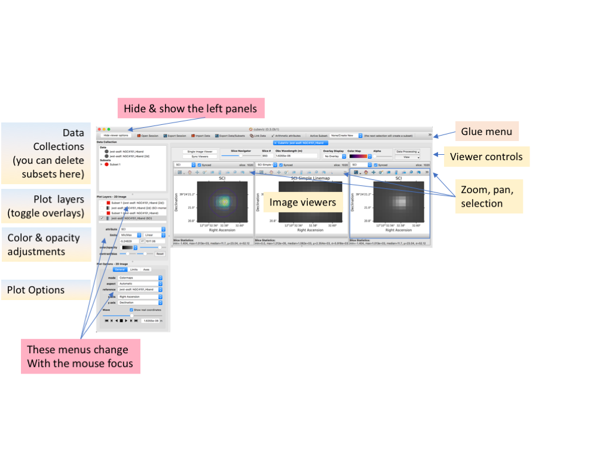
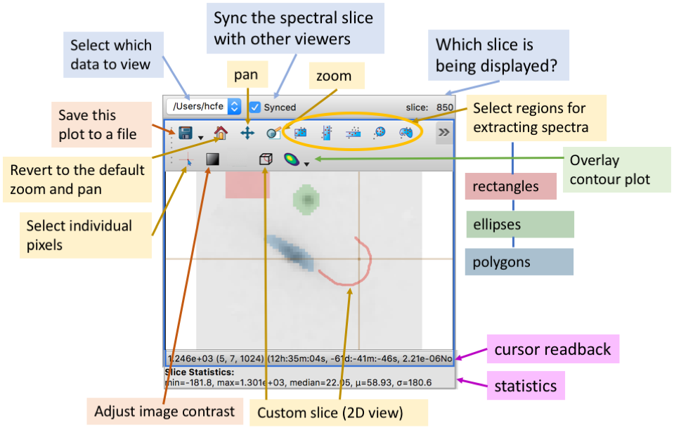

.. DANGER:: 

      Please note that this version of CubeViz is **no longer being actively supported
      or maintained**. The functionality of CubeViz is now available and being actively
      developed as part of `Jdaviz <https://github.com/spacetelescope/jdaviz>`_.

The Image Viewers
=================

The image viewers will show an image, along with overlays. The
overlays may indicate regions that are selected for analysis (e.g. 
1D spectrum display), or could be a contour map of another component.
To manipulate the image or the overlays, click on that image to ensure that it 
has the mouse focus, as indicated by the blue outline around the window. 
There are menus both to the left and above the image viewers. We will go through
these in turn.

Left Menus
----------

If you do not see menus at the left of your screen, click on the `Show viewer options` at
the top left; click `Hide viewer options` to hide them again.

The control panel at the middle left labeled **Plot Layers -- 2D image** will allow adjustment
of the colors, opacity, and contrast of the image or overlays. 
Select the plot layer you wish 
to adjust by clicking on the name of the component. 
Some sliders will appear right below the plot-layer
menu to allow you to adjust the settings. At the bottom left -- if the
mouse focus is in an image viewer -- there is a menu labled 
`Plot Options - 2D Image`. This menu has three tabs and allows a wide
range of adjustments:

    * General:

         * **mode:** Allows restricting to one color per layer
         * **aspect:** Can restrict the image viewers to have square pixels
         * **reference:** Will change which image component is visible in this viewer. (This is also selectable by the top left menu in each image viewer)
         * **x axis:** Selects which axis to show along the horizontal direction
         * **y axis:** Selects which axis to show along the vertical direction

    * Limits: Specify the limits of the axes or flip the directions
    * Axes: Adjust the axis labeling
        
Cube viewers menu bar
---------------------

There is menu across the top of the image viewers that provides access to some
cube-related functions. 

.. image:: images/upper_panel.png

This is below the very top glue menu bar.  From left to right on this menu, the controls are as follows:

    * **Image Viewer:** Toggles between a split-image 3-panel view and a single-image view
    * **Sync Viewer:** Syncs up the image viewers on the *spectral* axis; they are automatically synced spatially
    * **Slice Navigator:** Selects which pixel in the spectral axis to display in the image viewer with the mouse focus (or all of the viewers, if they are synced)
    * **Overlay Display:** Select and adjust colors and transparency (alpha) of images to overlay in the image viewers. (This is for semi-transparent image overlays; contour overlays are selected via a different menu, just above each image.)
    * **Data Processing:** Various cube operations:

       * **Collapse Cube:** Mathematical operations (e.g. sum, mean, median, etc) that reduce the 3D cube to a 2D image
       * **Spatial Smoothing:** Smoothing in the spatial dimension. This operation applies to every plane in the 3D cube, resulting in a new 3D cube, which can be selected from the image-viewer drop-down menus.
       * **Moment Maps:** This calculates moments in the spectral axis over the entire cube, resulting in a 2D image. Mathematical details are given in the documentation for `spectral-cube <https://spectral-cube.readthedocs.io/en/stable/>`__.
       * **Arithmetic Operations:** Allows simple arithmetic on components of the data (e.g. change the wavelengths).

    * **View:** Controls of the view for the image viewers (e.g. hide and show labels, axes, menus; adjust formats and units).

Image-viewer menus 
-------------------

Each individual image viewer has a small menu bar. These provide controls for saving images, zooming and panning, 
and selecting subsets (often called regions of interest or ROIs) for extraction from the cube. The >> at the right side of the menu expands it to show all the options. 

As of v0.3, not all of the features are fully implemented: (1) it is not possible to save a Python script to reproduce the plot, (2) not all of the controls or labeling are available in the custom-slice view.

Image-viewer information panels
-------------------------------

Below each image viewer are two sets of information: *cursor readback* and *statistics*. 

When the cursor is within the viewer, the cursor-readback panel will show the 
following information for the pixel that is under the cursor: 
Flux (cursor position in pixels) (cursor position in world coordinates: e.g. RA, Dec and wavelength).

The statistics panel gives the minimum, maximum, median, mean and standard deviation
for a region of interest. If no subsets are selected, then the information refers to the
entire wavelength slice that is visible (i.e. all the spaxels, but only for this one 
wavelength). If a subset is selected, then the statistics refer just to the pixels
within those spaxels (still within the single wavelength slice).

Selecting a Region in the Image Viewers      
---------------------------------------

Regions can be selected in the image viewers. If they are spatial
regions (RA, DEC), the cube will be collapsed in wavelength space
over the regions, and the resulting spectrum displayed in the spectrum viewer.

